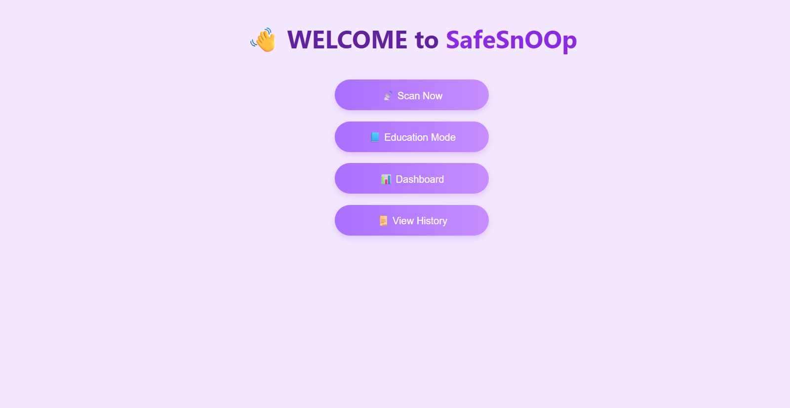
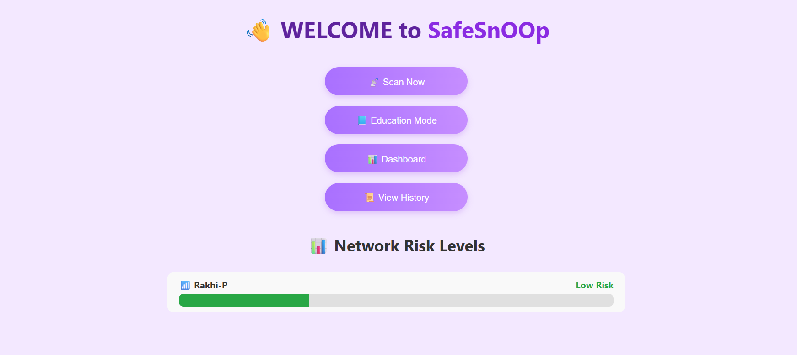
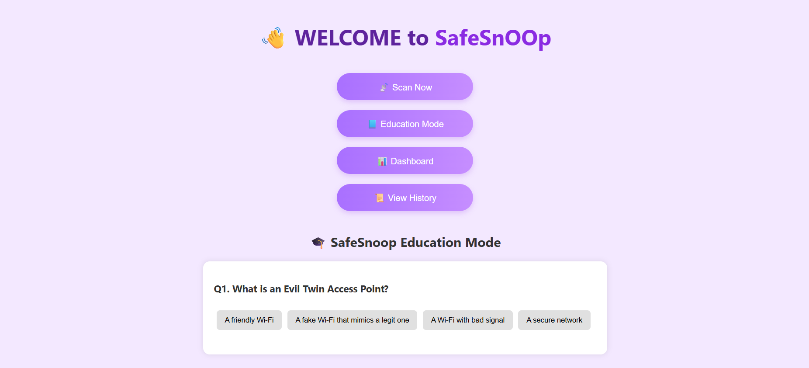

## Overview

This project is a Flask-based Wi-Fi network scanning and risk assessment tool that allows users to scan available wireless networks, evaluate their security level, and view past scan history through a simple and modern web interface.It uses the Windows `netsh wlan` command to detect nearby networks, analyzes factors such as signal strength, authentication type, and SSID patterns, and assigns a risk level (Low, Medium, High) to each network.  
The application also stores scan results with timestamps for future reference and includes a dashboard view for visualizing network security data.
---
## Results

